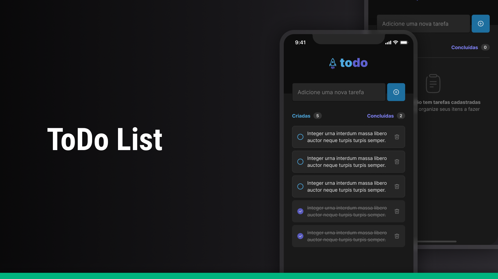

<h4 align="center">

</h4>

<h4 align="center">
    <p align="center">
      <a href="#-about">About</a>&nbsp;&nbsp;&nbsp;|&nbsp;&nbsp;&nbsp;
      <a href="#-technologies">Technologies</a>&nbsp;&nbsp;&nbsp;|&nbsp;&nbsp;&nbsp;
      <a href="#-how-to-run-the-project">Run</a>&nbsp;&nbsp;&nbsp;|&nbsp;&nbsp;&nbsp;
      <a href="#-info">Info</a>&nbsp;&nbsp;&nbsp;|&nbsp;&nbsp;&nbsp;
      <a href="#-license">License</a>
  </p>
</h4>

<h1 align="center">
    

</h1>

## 🔖 About

Todo List App é um aplicativo desenvolvido em React Native utilizando a biblioteca Expo. Ele foi projetado para fornecer uma solução simples e intuitiva para gerenciar tarefas diárias. O aplicativo permite aos usuários adicionar tarefas, visualizar a lista completa, marcar tarefas como concluídas e remover tarefas.

O aplicativo oferece um campo de entrada de texto onde os usuários podem inserir o nome da tarefa a ser adicionada à lista. Ao tocar no botão "+", a tarefa é incluída na lista exibida na tela principal.

As tarefas são exibidas em uma FlatList, fornecendo uma visualização organizada e eficiente. Cada item da lista exibe o nome da tarefa adicionada.

Os usuários podem marcar tarefas como concluídas ao tocar em um botão de marcação associado a cada item da FlatList. Isso permite um acompanhamento visual das tarefas concluídas e ajuda na organização das atividades.

Os usuários podem remover tarefas da lista ao tocar no botão de remoção associado a cada item da FlatList. Isso permite uma gestão flexível da lista, permitindo que os usuários eliminem tarefas concluídas ou não relevantes.

[DETALHES](docs/ABOUT.md)

## 🚀 Technologies

- [ReactNative](https://reactnative.dev/)
- [Typescript](https://www.typescriptlang.org/)
- [Expo](https://expo.dev/)

## 🏁 How to run the project

```sh
# Clone the repository
git clone https://github.com/rafinhaa/todo-app.git
cd todo-app

# Install the dependencies
yarn install

# Start the Android application
yarn android

# Start the iOS application
yarn ios
```

## ℹ️ Info

## 📄 Changelog

## 📝 License

[MIT](LICENSE.txt)

**Free Software, Hell Yeah!**
